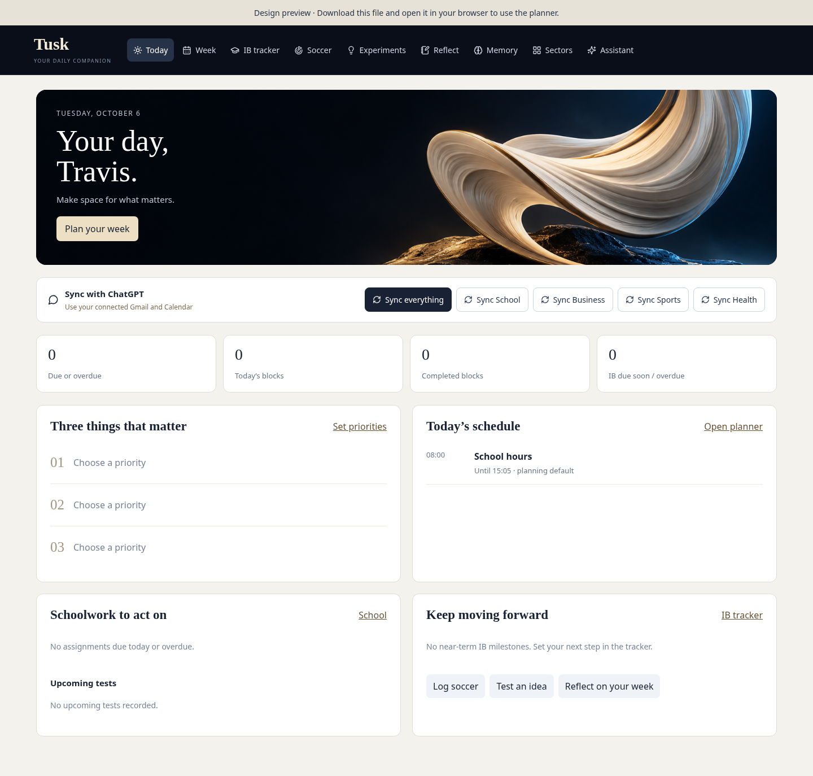

# Tusk browser preview

The image below shows the updated Today screen, using the design and artwork
from the supplied Tusk source. This page displays the design without downloading
or installing anything.

To use the planner:

1. Open [Tusk-browser.zip](Tusk-browser.zip) and click GitHub's **Download raw file** button (↓).
2. Extract the ZIP.
3. Open **index.html** in Chrome, Edge, Firefox or Safari.

No install script, Node.js or start command is needed for this browser copy.
The ZIP includes the standalone app, the screenshot and opening instructions.
The planner saves records in the browser used to open it. The design stays
visible if scripts or storage are blocked.

This branch contains the updated Vite frontend and its browser preview. It has
not been merged into `main` or deployed to the original ChatGPT site. Hosted
sign-in and connected sync require the original published site's services.

Validation: 31 Node tests passed; production build passed; browser checks passed
for navigation, saved priorities and layouts with scripts blocked.
